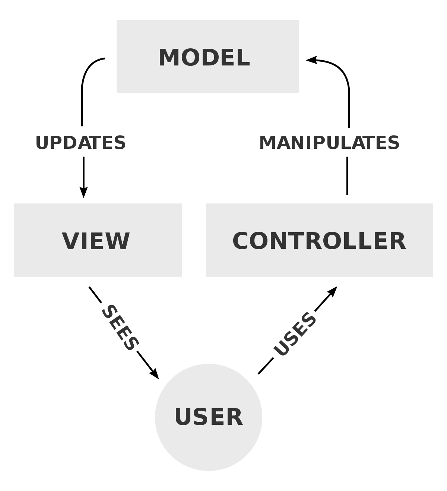
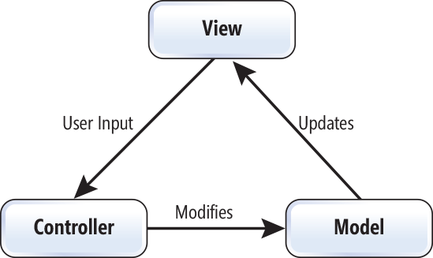

## So, what in the world is MVC?

### Дорогой интернет, что такое MVC?

    
    
    

    
    

### И это не все!

### Какая схема правильная/наилучшая?

#### Да они все ничего.
<blockquote>

MVC часто называют паттерном, но я не вижу особой пользы воспринимать его как паттерн,
поскольку он включает в себя множество различных идей.

Разные люди читают про MVC в различных источниках и извлекают оттуда разные идеи, но называют их одинаково — «MVC».
Это приводит к большой путанице и кроме того служит источником недоразумений и непониманию MVC,
как будто бы люди узнавали про него через «испорченный телефон»…

Я уже потерял счет сколько раз я видел что-то, описываемое как MVC, которое им не оказывалось.

<footer>&nbsp; ― &nbsp;Мартин Фаулер</footer>
</blockquote>

### Приложение без архитектуры

### Шаг 1. Divide and Conquer

### Шаг 2. Low Coupling

<pre style="width: 57%"><code class="javascript" data-trim data-noescape>
class TodoModel {
  constructor(view) {
    this.view = view;
    this.list = [
      { title: "Wake up", completed: false }
      { title: "Cloud dispersal", completed: false }
    ];
  }

  getTodos() {
    return this.list;
  }

  setCompleted(id) {
    this.list[id].completed = true;
    this.view.notify();
  }
}
</code></pre>
<pre style="width: 42%"><code class="javascript" data-trim data-noescape>
class TodoUI {
  constructor(model) {
    this.model = model;
  }

  notify() {
    this.render();
  }

  render(data) {
    const data = this.model.getTodos();
    . . .
  }
}
</code></pre>

### `Observer`

<pre style="width: 57%"><code class="javascript" data-trim data-noescape>
class TodoModel {
  constructor() {
<mark>&nbsp;</mark>   this.observer = new Observable();
    this.list = [
      { title: "Wake up", completed: false }
      { title: "Cloud dispersal", completed: false }
    ];
  }

  getTodos() {
    return this.list;
  }

  setCompleted(id) {
    this.list[id].completed = true;
<mark>&nbsp;</mark>   this.observer.notify();
  }

<mark>&nbsp;</mark> subscribe(cb) {
<mark>&nbsp;</mark>   this.observer.subscribe(cb);
<mark>&nbsp;</mark> }
}
</code></pre>
<pre style="width: 42%"><code class="javascript" data-trim data-noescape>
class TodoUI {
  constructor(model) {
    this.model = model;
<mark>&nbsp;</mark>   this.model.subscribe(
<mark>&nbsp;</mark>     this.notify.bind(this));
  }

  notify() {
    this.render(data);
  }

  render(data) {
    const data = this.model.getTodos();
    . . .
  }
}
</code></pre>

### Шаг 3. Low Coupling-2

### Façade

  

    
  

  

    
  

### Шаг 4: Divide and Conquer-2

### Who are you, Mr. Controller?

  
  

### Схемы MVC

  

    
  

  

    
  

### Facebook и все-все-все

фатальный недостаток: MVC написали не мы!

    

        
    

    

        
        
    

### React is V in MVC.. oh wait, not anymore

### Экосистема React - Redux

### Чтение на лето

 - [Habr: Охота на мифический MVC - 1](https://habr.com/ru/post/321050/)
 - [Habr: Охота на мифический MVC - 2](https://habr.com/ru/post/322700/)
 - Ссылка на доклад:

